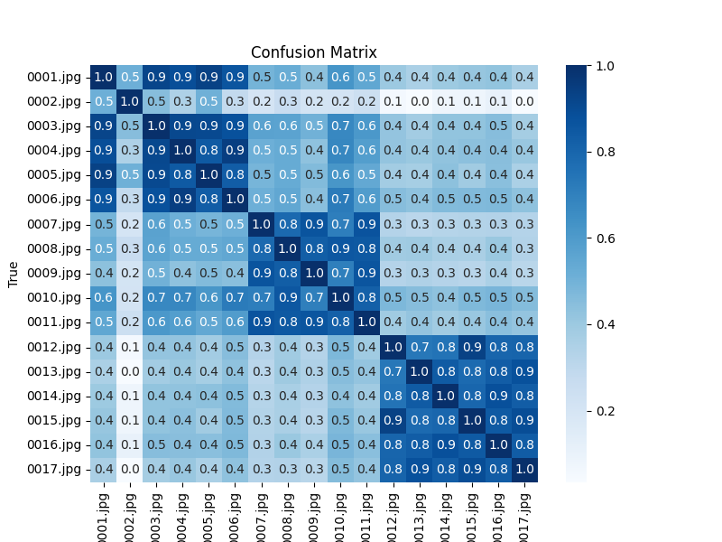
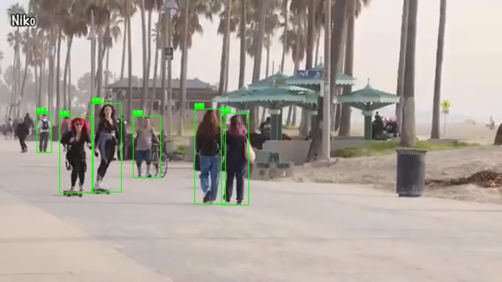

# Person Re-Identification using [LA-Transformer](https://github.com/SiddhantKapil/LA-Transformer.git).

Added some demo codes.

- See other outputs of Re-id_demo.py in the [Out dir](Video/Out). The code keep storing features in a list and when new features are detected from next frame, it calculates cosine similarity and assigns a person ID based on the maximum similarity above a certain threshold. If a new feature does not match then person id is going to be index of the new feature in the list.

- The Outputs the in [fliped dir](Video/Out/fliped) are generated by not only sending a person into the model. It is generated by also sending a fliped image of the person. Adding both features will be more robust to represent the person.

- In the flipped version, the model consistently tries to assign the same ID to the person wearing an orange t-shirt and cap when he first appears and later on.

- Output of LA_transformer_demo.py. See how, for same person image cosine similarity is high. Persons images in [imgs dir](Persons_imgs/Imgs) were taken from the Market-1501 dataset.

- Output of person_detection.py.

## Credits:

- [LA-Transformer](https://github.com/SiddhantKapil/LA-Transformer.git)